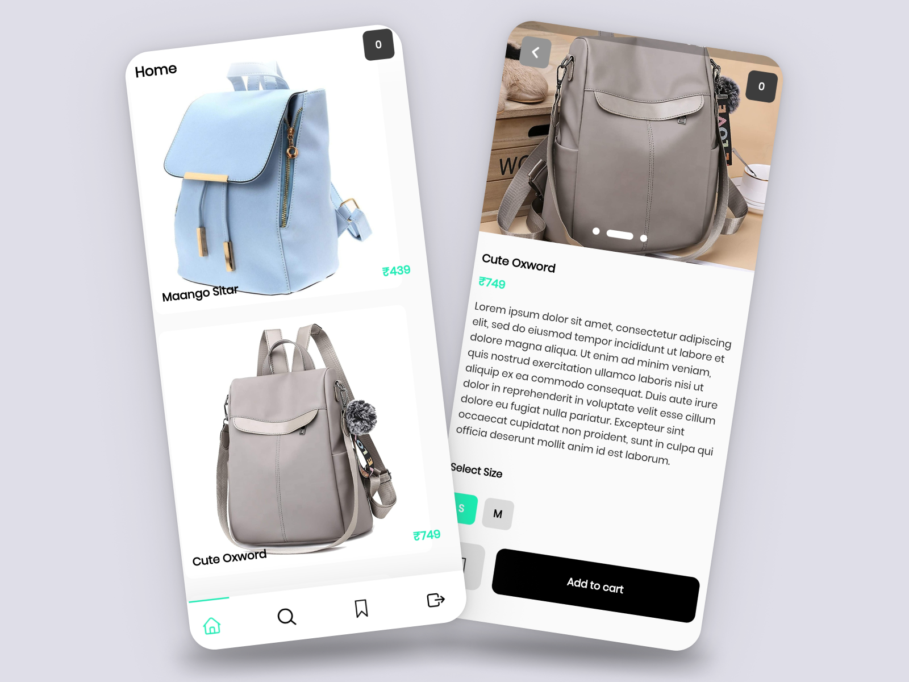

# Baggy - Ecommerce Bag App


**Build From Home by TinkerHub Foundation**

Baggy is a remarkable mobile ecommerce application developed as part of the "Build From Home" initiative by TinkerHub Foundation. This project demonstrates the incredible capability of building a product from scratch and successfully deploying it within just 7 days. Baggy is tailored exclusively for bag enthusiasts, offering an extensive collection of bags from various brands and styles. With Baggy, users can seamlessly explore, search, and purchase their preferred bags, providing a convenient and enjoyable shopping experience.

## Table of Contents

- [Getting Started](#getting-started)
  - [Prerequisites](#prerequisites)
  - [Installation](#installation)
- [Features](#features)
- [Usage](#usage)
- [Screenshots](#screenshots)
- [Contributing](#contributing)

## Getting Started

These instructions will guide you through setting up and running the Baggy app on your local development environment.

### Prerequisites

- **Flutter**: Ensure you have Flutter installed. If not, you can refer to the [official Flutter installation guide](https://flutter.dev/docs/get-started/install) for setup instructions.

### Installation

1. Clone the Baggy repository to your local machine:

   ```bash
   git clone https://github.com/your-username/baggy.git
   ```

2. Navigate to the project directory:

   ```bash
   cd baggy
   ```

3. Install the app's dependencies:

   ```bash
   flutter pub get
   ```

4. Run the app:

   ```bash
   flutter run
   ```

Now, you should have the Baggy app up and running on your development machine.

## Features

Baggy offers an array of features to enhance the bag shopping experience:

- **Product Listings**: Explore and view a diverse range of bags.
- **Search**: Locate specific bags by brand, type, or keyword.
- **Product Details**: Access comprehensive information about each bag, including price, description, and customer reviews.
- **Add to Cart**: Conveniently add bags to your shopping cart.
- **Shopping Cart**: Review and manage the items in your cart.
- **Checkout**: Securely complete your purchase with various payment options.

## Usage

Baggy is designed to be user-friendly and intuitive. Users can easily navigate the app by following these simple steps:

1. Open the Baggy app on your mobile device.
2. Browse or search for bags that catch your eye.
3. Tap on a bag to view its details.
4. Add the desired bag to your cart when ready to purchase.
5. Review the contents of your cart and proceed to checkout.
6. Select your preferred payment method and finalize your purchase.

Enjoy your new bag!

## Screenshots



## Contributing

We welcome contributions to improve Baggy! To contribute, please adhere to the following steps:

1. Fork the repository.
2. Create a new branch for your feature or bug fix.
3. Implement your changes and commit them.
4. Push your changes to your fork.
5. Generate a pull request with a clear description of your modifications.

We greatly appreciate your contributions!

